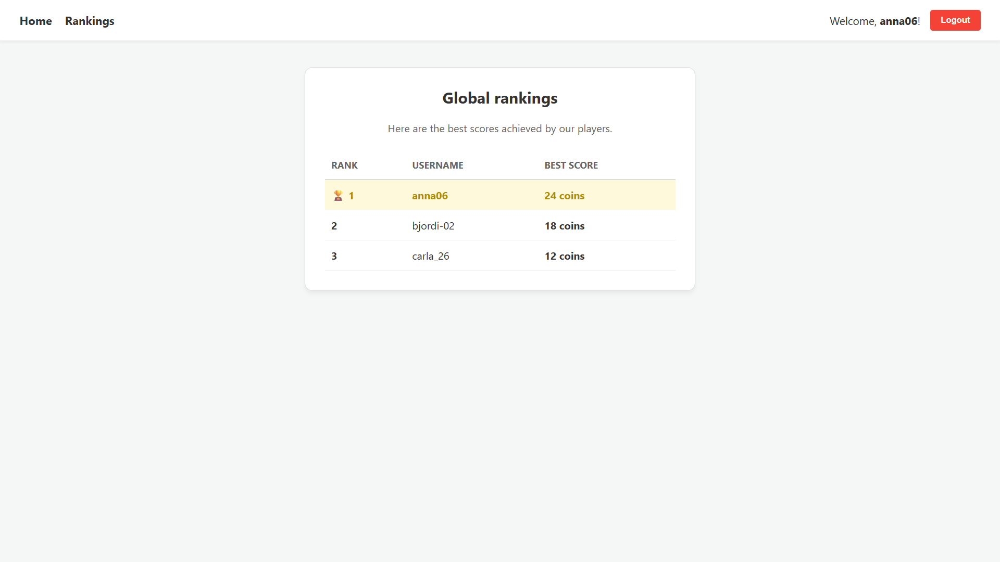
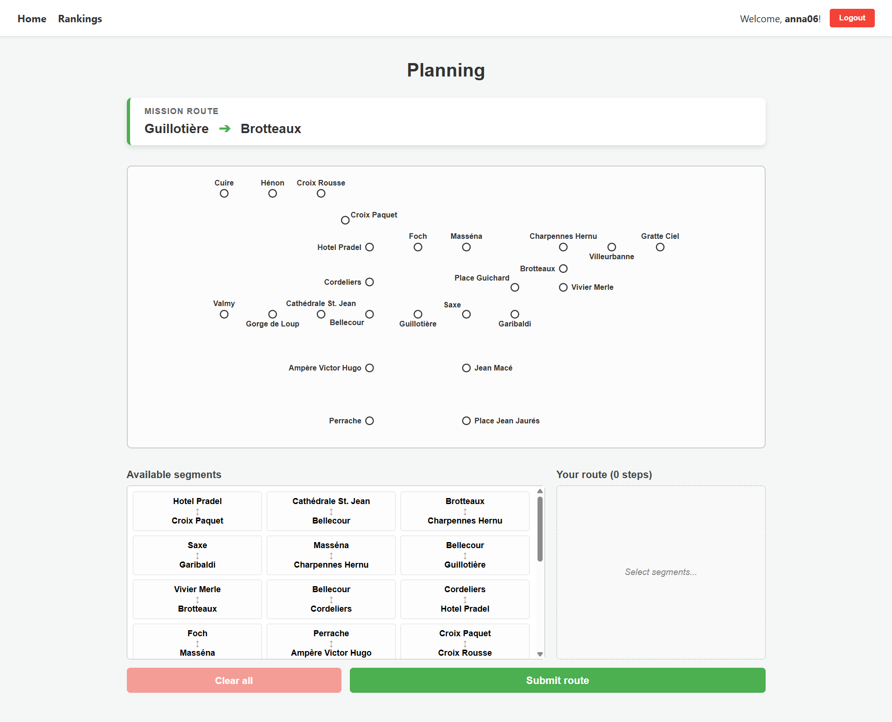

# Exam #1: "Last Race"
## Student: s346120 GURRA BJORDI 

## React Client Application Routes

- Route `/`: home page of the game, showing game instructions (structured in phases) and encouraging the user to play by pressing the main button below (available only after login)
- Route `/login`: login form page, it requires username and password to succesfully log in
- Route `/game`: core game interface, that handles all game phases (setup, planning, execution, result) only for authenticated users
- Route `/rankings`: leaderboard of the highest scoring games of registered users (who played at least one time) are shown here, ranked all together
- Route `/*`: "404 - Page not found" message page for invalid URLs

## API Server

- GET `/api/stations`
  - request parameters and request body content: none
  - response body content: JSON array of objects representing all metro stations
- GET `/api/lines`
  - none
  - JSON array of objects representing all metro lines
- GET `/api/events`
  - none
  - JSON array of objects representing all unexpected events
- GET `/api/mission` (Protected)
  - none
  - JSON object containing one start and one destination station, respecting distance requirement
- POST `/api/sessions`
  - JSON object with username and password
  - JSON object representing the authenticated user
- DELETE `/api/sessions/current`
  - none
  - empty body with status "200 OK"
- GET `/api/rankings`
  - none
  - JSON array representing registered users with their highest score in the game, in descending order
- POST `/api/games` (Protected)
  - JSON object containing the score of the finished game
  - JSON object with the database id of the saved record and the saved score

## Database Tables

- Table `events` - contains the unexpected events that occur when reviewing the game journey, alogn with their effect on coins (id, description, effect)
- Table `games` - contains game scores achieved by registered users (id, user_id, score)
- Table `lines` - contains metro line nemes (id, name)
- Table `segments` - contains segments of the metro lines between stations (id, station_a, station_b, line_id)
- Table `stations` - contains station details, along with coordinates of dots and respective labels in the map displayed during the game (id, name, x, y, label_dx, label_dy, label_anchor)
- Table `users` - contains credentials of registered users (id, username, hash, salt)

## Main React Components

- `App` (in `App.jsx`): root component that manages the global application state (logged in user) and handles React Router definitions
- `Game` (in `Game.jsx`): component that handles the logic of the game, managing the four phases, timer, svg map rendering and resolution of the submitted route
- `Home` (in `Home.jsx`): component that displays game instructions and the button to start playing the game
- `Login` (in `Login.jsx`): component that handles the login procedure of the user with a form for authentication
- `Navbar` (in `Navbar.jsx`): navigation header with links to the Home, Rankings and Login routes, also managing logout once already logged in
- `Rankings` (in `Rankings.jsx`): component that displays the leaderboard of registered users (best scores for each one only)

## Screenshot

## Users Credentials

- anna06, password
- bjordi-02, password
- carla_26, password

## Use of AI Tools

This project was developed with the use of AI tools (mostly Google Gemini and Github Copilot in VSCode) for code generation and debugging, and also clarifying concepts introducted in the course.
Their output was verified empirically by directly testing the website before the project submission.
